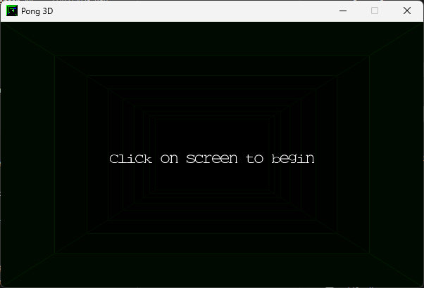

# Pong3D

Pong game in three dimensions write in C using SDL2 and OpenGL 3, recreation of the pong 3d game by Liquid Media (www.liquid.se/pong).



## Building and running

This program depends on:

* SDL2 lib
* Freetype2 lib
* Glew
* OpenGL libraries (3.2)


### Build on Unix/Linux systems

1. Install dependencies SDL2, Freetype2, Glew and OpenGL 4 using system package manager.

By example, in Debian based systems:

```
# apt-get install libsdl2-dev libglew-dev libfreetype6-dev
```

2. Build

```
make
```

3. Run with

```
./pong3d
```

### Build on Windows with Visual Studio with NuGet

1. Download and install [Visual Studio 2017 Community](https://www.visualstudio.com/thank-you-downloading-visual-studio/?sku=Community&rel=15) Make Sure that NuGet is selected when install.
2. Open ${projectDir}\build\windows\vs2017\Pong3D.sln
3. Select solution, open context menu and select Recompile.
4. Execute.

### Build on Windows (64 bits) with Visual Studio and CMake

1. Download and install [Visual Studio 2017 Community](https://www.visualstudio.com/thank-you-downloading-visual-studio/?sku=Community&rel=15)
2. Download and install [CMake for Windows](https://cmake.org/download/) CMake version must be >= 3.8
3. Download [SDL2 developement libraries for VC++](https://www.libsdl.org/download-2.0.php) for VC (SDL2-devel-2.X.X-VC.zip) and unzip at any location on disk
4. Download [GLEW binaries](http://glew.sourceforge.net/) and unzip at any location on disk
5. Download Freetype binaries for windows [here](https://github.com/ubawurinna/freetype-windows-binaries) Clone repo at any location on disk
6. Open Windows Console Prompt
7. Set environment variables with locations of libraries downloaded before.

```
set SDL2_DIR=<SDL2_lib location>
set FREETYPE_DIR=<Fretype lib location>
set GLEW_DIR=<glew lib location>
```

8. Go to project source

```
> cd pong3d
```

9. Create build directory

```
> md build
```

10. Change to build directory

```
> cd build
```

11. Execute CMake

```
cmake .. -G "Visual Studio 15 2017 Win64"
```

12. Open Pong3D.sln
13. Recompile solution and set *pong3d project* as initial project.
14. Modifiy your system PATH environment variable adding each DLL directory for 64 bits. This is for execute program from Visual Studio without copy DLL files in project directory; or copy DLLs to project folder.
15. Now you can Execute or Debug project.


### Run on Windows with MSYS2

1. Install [MSYS2](https://www.msys2.org/)

2. Open msys2 terminal. Make sure you have build tools installed (mingw64, binutils)

3. Install dependencies SDL2, Glew, Freetype2

```
pacman -S mingw64/mingw-w64-x86_64-SDL2 mingw64/mingw-w64-x86_64-glew mingw64/mingw-w64-x86_64-freetype
```
4. make sure that gcc points to /mingw64/bin/gcc with

```
which gcc
```

If not, install mingw-64

```
pacman -S mingw-w64-x86_64-gcc
```

5. Build

```
make -f Makefile.msys2
```

6. Run in msys2 terminal with

```
./pong3d.exe
```


## License

Pong3d is licensed under the MIT license. (http://opensource.org/licenses/MIT)
